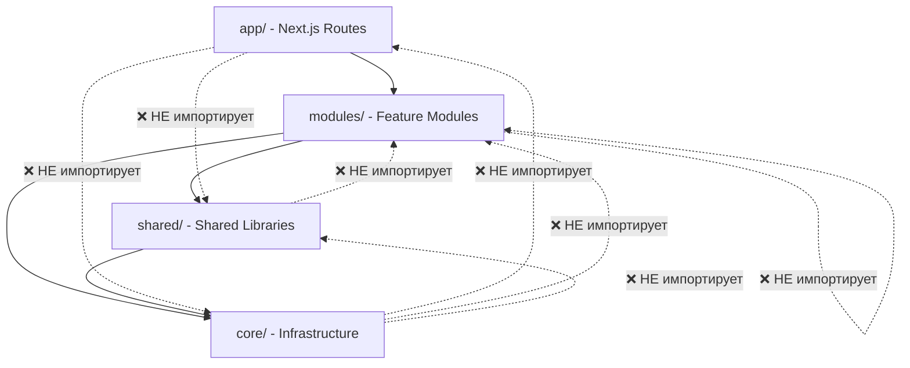

# 🏗️ Архитектура LearningCraft

## 📋 Обзор

Проект LearningCraft реализован по **модульной архитектуре типа "конструктор Лего"**, где каждый модуль является независимым и может разрабатываться, тестироваться и поддерживаться отдельно от других частей системы.

### 🎯 Ключевые принципы:
- **Модульность**: Каждый модуль инкапсулирует полную функциональность
- **Независимость**: Модули не зависят друг от друга
- **Переиспользование**: Общие компоненты в shared библиотеках
- **Типизация**: Полная типизация TypeScript
- **Темы**: Встроенная поддержка светлой/темной темы

## 📁 Структура проекта

```
src/
├── modules/          # 🧩 Функциональные модули (features)
│   ├── auth/         # 🔐 Аутентификация
│   ├── quiz/         # 📝 Прохождение квизов
│   ├── quiz-generation/ # 🤖 Генерация квизов
│   ├── dashboard/    # 📊 Дашборд пользователя
│   └── landing/      # 🏠 Лендинг страница
├── shared/           # 🔧 Общие библиотеки
│   ├── ui/           # 🎨 UI компоненты
│   ├── theme/        # 🌓 Система тем
│   ├── data-access/  # 💾 Доступ к данным
│   ├── i18n/         # 🌍 Интернационализация
│   ├── utils/        # 🛠️ Утилиты
│   └── types/        # 📝 Общие типы
├── core/             # ⚙️ Ядро приложения
│   ├── config/       # ⚙️ Конфигурация
│   ├── providers/    # 🔌 Провайдеры
│   └── middleware/   # 🛡️ Middleware
└── app/              # 🚀 Next.js App Router (тонкий слой)
```

## 🧩 Модули (modules/)

Каждый модуль инкапсулирует полную функциональность одной фичи и имеет четкую структуру:

```
modules/[feature]/
├── components/     # React компоненты
├── hooks/         # Custom React hooks
├── services/      # Бизнес-логика
├── types/         # TypeScript типы
├── api/           # API endpoints (если есть)
├── index.ts       # Public API модуля
└── README.md      # Документация модуля
```

### 🔐 modules/auth - Аутентификация

**Назначение**: Управление аутентификацией пользователей

**Компоненты**:
- `AuthGuard` - Защита маршрутов
- `SignInForm` - Форма входа
- `SignUpForm` - Форма регистрации
- `GoogleSignInButton` - OAuth вход
- `UserMenu` - Меню пользователя

**Хуки**:
- `useAuth` - Основной хук аутентификации
- `useIsAuthenticated` - Проверка статуса
- `useUser` - Алиас для useAuth

**Сервисы**:
- `authService` - Основной сервис аутентификации

**Типы**:
```typescript
interface User {
  id: string;
  email: string;
  name?: string;
  avatar_url?: string;
  user_metadata?: {
    full_name?: string;
    picture?: string;
  };
}

interface SignInCredentials {
  email: string;
  password: string;
}
```

**Пример использования**:
```typescript
import { useAuth, AuthGuard } from '@/modules/auth';

function ProtectedPage() {
  const { user, isLoading } = useAuth();
  
  if (isLoading) return <div>Loading...</div>;
  
  return (
    <AuthGuard>
      <div>Welcome, {user?.name}!</div>
    </AuthGuard>
  );
}
```

### 🤖 modules/quiz-generation - Генерация квизов

**Назначение**: Создание квизов из PDF файлов с помощью AI

**Компоненты**:
- `FileDropzone` - Загрузка PDF файлов
- `SubjectSelector` - Выбор предмета
- `DifficultySelector` - Выбор сложности
- `QuestionSlider` - Количество вопросов

**Сервисы**:
- `parsePDF` - Извлечение текста из PDF
- `generateQuizWithAI` - Генерация квиза через OpenRouter
- `generateQuizPrompt` - Создание промптов для AI

**API**:
- `POST /api/quiz/generate` - Генерация квиза

**Типы**:
```typescript
interface QuizConfig {
  subject: QuizSubject;
  difficulty: QuizDifficulty;
  questionCount: number;
}

interface QuizGenerationRequest {
  fileUrl: string;
  config: QuizConfig;
}
```

**Пример использования**:
```typescript
import { FileDropzone, SubjectSelector, DifficultySelector } from '@/modules/quiz-generation';

function QuizGenerator() {
  const [config, setConfig] = useState<QuizConfig>({
    subject: 'mathematics',
    difficulty: 'medium',
    questionCount: 10
  });

  return (
    <div>
      <FileDropzone onFileUpload={handleFileUpload} />
      <SubjectSelector value={config.subject} onChange={setSubject} />
      <DifficultySelector value={config.difficulty} onChange={setDifficulty} />
    </div>
  );
}
```

### 📝 modules/quiz - Прохождение квизов

**Назначение**: Интерфейс для прохождения квизов

**Компоненты**:
- `QuestionCard` - Карточка вопроса
- `QuizProgress` - Прогресс прохождения
- `QuestionGrid` - Сетка вопросов
- `ConfirmationModal` - Подтверждение отправки
- `ScoreCircle` - Круговая диаграмма результата
- `QuestionReview` - Обзор ответов

**Хуки**:
- `useQuiz` - Управление состоянием квиза

**Сервисы**:
- `quizService` - Операции с квизами

**Типы**:
```typescript
interface Quiz {
  id: string;
  title: string;
  subject: string;
  difficulty: string;
  questions: Question[];
}

interface Question {
  id: string;
  text: string;
  options: string[];
  correctAnswer: number;
  explanation?: string;
}
```

**Пример использования**:
```typescript
import { useQuiz, QuestionCard, QuizProgress } from '@/modules/quiz';

function QuizPage({ quizId }: { quizId: string }) {
  const { quiz, currentQuestion, selectAnswer, submitQuiz } = useQuiz(quizId);

  return (
    <div>
      <QuizProgress current={currentQuestion} total={quiz.questions.length} />
      <QuestionCard 
        question={quiz.questions[currentQuestion]}
        onSelectAnswer={selectAnswer}
      />
    </div>
  );
}
```

### 📊 modules/dashboard - Дашборд пользователя

**Назначение**: Управление квизами пользователя

**Компоненты**:
- `QuizList` - Список квизов
- `QuizCard` - Карточка квиза
- `QuizFilters` - Фильтры и сортировка
- `QuizStats` - Статистика пользователя
- `Pagination` - Пагинация
- `DeleteQuizModal` - Удаление квиза
- `EmptyState` - Пустое состояние

**Сервисы**:
- `dashboardService` - Операции с дашбордом

**Типы**:
```typescript
interface DashboardQuiz {
  id: string;
  title: string;
  subject: string;
  difficulty: string;
  questionCount: number;
  createdAt: Date;
  lastAttempt?: Date;
  bestScore?: number;
  attemptCount: number;
}

interface DashboardStats {
  totalQuizzes: number;
  totalAttempts: number;
  averageScore: number;
  bestScore: number;
  recentActivity: Activity[];
}
```

**Пример использования**:
```typescript
import { QuizList, QuizStats, QuizFilters } from '@/modules/dashboard';

function DashboardPage() {
  const [filters, setFilters] = useState<DashboardFilters>({});
  const [stats, setStats] = useState<DashboardStats | null>(null);

  return (
    <div>
      <QuizStats stats={stats} />
      <QuizFilters filters={filters} onChange={setFilters} />
      <QuizList filters={filters} />
    </div>
  );
}
```

### 🏠 modules/landing - Лендинг страница

**Назначение**: Маркетинговая страница

**Компоненты**:
- `LandingPage` - Главная страница
- `Hero` - Герой секция
- `Features` - Особенности
- `HowItWorks` - Как это работает
- `Pricing` - Цены
- `Testimonials` - Отзывы
- `FAQ` - Частые вопросы
- `FinalCTA` - Призыв к действию
- `Header` - Шапка сайта
- `Demo` - Демо
- `SocialProof` - Социальные доказательства
- `Subjects` - Предметы

## 🔧 Общие библиотеки (shared/)

### 🎨 shared/ui - UI компоненты

**Назначение**: Переиспользуемые UI компоненты

**Компоненты**:
- `Button` - Кнопки с вариантами (default, outline, ghost)
- `Input` - Поля ввода
- `Modal` - Модальные окна
- `Card` - Карточки

**Особенности**:
- Поддержка темной/светлой темы через CSS переменные
- Типизированные props с TypeScript
- Адаптивный дизайн
- Доступность (a11y)

**Пример использования**:
```typescript
import { Button, Card, Input } from '@/shared/ui';

function MyComponent() {
  return (
    <Card>
      <Input placeholder="Enter your name" />
      <Button variant="outline" size="lg">
        Submit
      </Button>
    </Card>
  );
}
```

### 🌓 shared/theme - Система тем

**Назначение**: Управление темами приложения

**Компоненты**:
- `ThemeProvider` - Провайдер темы
- `ThemeToggle` - Переключатель темы

**Хуки**:
- `useTheme` - Основной хук темы
- `useThemeToggle` - Переключение темы

**CSS переменные**:
```css
:root {
  --lc-background: #ffffff;
  --lc-foreground: #000000;
  --lc-primary: #3b82f6;
  --lc-secondary: #64748b;
}

[data-theme="dark"] {
  --lc-background: #0f172a;
  --lc-foreground: #f8fafc;
  --lc-primary: #60a5fa;
  --lc-secondary: #94a3b8;
}
```

**Пример использования**:
```typescript
import { useTheme, ThemeToggle } from '@/shared/theme';

function Header() {
  const { theme, toggleTheme } = useTheme();
  
  return (
    <header>
      <h1>My App</h1>
      <ThemeToggle />
    </header>
  );
}
```

### 💾 shared/data-access - Слой доступа к данным

**Назначение**: Абстракция над источниками данных

**Клиенты**:
- `createClient` - Браузерный клиент
- `createServerClient` - Серверный клиент
- `createRouteHandlerClient` - Клиент для API routes

**Типы**:
- `Database` - Типы базы данных Supabase
- `Tables` - Типизированные таблицы

**Пример использования**:
```typescript
import { createClient } from '@/shared/data-access';

export async function getQuizzes() {
  const supabase = createClient();
  const { data, error } = await supabase
    .from('quizzes')
    .select('*');
  
  if (error) throw error;
  return data;
}
```

### 🌍 shared/i18n - Интернационализация

**Назначение**: Поддержка множественных языков

**Конфигурация**:
- Поддерживаемые локали: `ru`, `be`
- Дефолтная локаль: `ru`
- Автоматическое определение языка

**Хуки**:
- `useTranslation` - Хук для переводов
- `useLocale` - Текущая локаль

**Структура словарей**:
```typescript
interface Dictionary {
  landing: {
    hero: {
      title: string;
      subtitle: string;
    };
    features: {
      title: string;
      items: Array<{
        title: string;
        description: string;
      }>;
    };
  };
  auth: {
    signIn: {
      title: string;
      email: string;
      password: string;
    };
  };
}
```

**Пример использования**:
```typescript
import { useTranslation, useLocale } from '@/shared/i18n';

function MyComponent() {
  const t = useTranslation();
  const locale = useLocale();
  
  return (
    <div>
      <h1>{t.landing.hero.title}</h1>
      <p>{t.landing.hero.subtitle}</p>
    </div>
  );
}
```

### 🛠️ shared/utils - Утилиты

**Назначение**: Общие утилитарные функции

**Функции форматирования**:
- `cn(...inputs)` - Объединение CSS классов
- `formatDate(date, locale)` - Форматирование дат
- `calculatePercentage(value, total)` - Расчет процентов

**Функции валидации**:
- `isValidEmail(email)` - Валидация email
- `isValidPassword(password)` - Валидация пароля
- `isValidFileType(file, allowedTypes)` - Валидация типов файлов

**Функции работы с датами**:
- `formatRelativeTime(date)` - Относительное время
- `formatDateRange(start, end)` - Диапазон дат

**Пример использования**:
```typescript
import { cn, formatDate, isValidEmail } from '@/shared/utils';

function MyComponent({ className, user, email }) {
  const isValid = isValidEmail(email);
  
  return (
    <div className={cn('base-styles', className)}>
      <p>User: {user.name}</p>
      <p>Joined: {formatDate(user.createdAt)}</p>
      <p>Email valid: {isValid ? 'Yes' : 'No'}</p>
    </div>
  );
}
```

### 📝 shared/types - Общие типы

**Назначение**: Общие TypeScript типы

**Типы**:
- `QuizDifficulty` - Сложность квиза
- `QuizSubject` - Предмет квиза
- `Locale` - Поддерживаемые локали
- `Theme` - Темы приложения

**Пример использования**:
```typescript
import type { QuizDifficulty, QuizSubject, Locale, Theme } from '@/shared/types';

interface QuizConfig {
  subject: QuizSubject;
  difficulty: QuizDifficulty;
  locale: Locale;
  theme: Theme;
}
```

## Ядро (core/)

### core/config - Конфигурация
- Константы приложения (QUIZ_SUBJECTS, QUIZ_DIFFICULTIES)
- Валидация environment variables
- Feature flags
- App configuration

### core/providers - Глобальные провайдеры
- AppProviders - объединяет все провайдеры
- ThemeProvider
- (TODO: AuthProvider, QueryProvider)

### core/middleware - Middleware логика
- auth.ts - аутентификация
- locale.ts - локализация

## 🔄 Поток зависимостей



### 📋 Правила зависимостей:

| Слой | Может импортировать | Не может импортировать |
|------|-------------------|----------------------|
| `app/` | ✅ `modules/` | ❌ `shared/`, `core/` |
| `modules/` | ✅ `shared/`, `core/` | ❌ Другие модули, `app/` |
| `shared/` | ✅ `core/` | ❌ `modules/`, `app/` |
| `core/` | ❌ Ничего | ❌ Все остальные слои |

### 🎯 Преимущества такой архитектуры:

1. **Изоляция**: Модули не зависят друг от друга
2. **Переиспользование**: Shared библиотеки доступны всем модулям
3. **Тестируемость**: Каждый слой можно тестировать изолированно
4. **Масштабируемость**: Легко добавлять новые модули
5. **Поддержка**: Изменения в одном слое не влияют на другие

## Public API модулей

Каждый модуль экспортирует только свой публичный интерфейс через `index.ts`:

```typescript
// modules/quiz/index.ts
export { QuizTakingPage } from './components/QuizTakingPage';
export { useQuiz } from './hooks/useQuiz';
export { quizService } from './services';
export type { Quiz, Question, QuizAttempt } from './types';

// Note: API endpoints are NOT exported in public API
// They are only used by Next.js router and should not be imported in components
```

### Важные правила для Public API:

1. **НЕ экспортируйте API endpoints** - они содержат серверный код и не должны импортироваться в клиентских компонентах
2. **Экспортируйте только клиентские компоненты, хуки, сервисы и типы**
3. **Используйте barrel exports** для удобного импорта
4. **Документируйте публичный API** в README модуля

## Примеры использования

### Использование модуля в странице
```typescript
// app/[locale]/quiz/[id]/page.tsx
import { QuizTakingPage } from '@/modules/quiz';

export default function QuizPage({ params }) {
  return <QuizTakingPage quizId={params.id} />;
}
```

### Использование shared UI
```typescript
// modules/quiz/components/QuestionCard.tsx
import { Button, Card } from '@/shared/ui';

export function QuestionCard() {
  return (
    <Card>
      <Button>Submit</Button>
    </Card>
  );
}
```

### Использование data-access
```typescript
// modules/quiz/services/quiz-service.ts
import { createClient } from '@/shared/data-access';

export const quizService = {
  async getQuiz(id: string) {
    const supabase = createClient();
    return supabase.from('quizzes').select('*').eq('id', id).single();
  }
};
```

## 🚀 Преимущества архитектуры

### 🛠️ Для разработки
- **🧩 Модульность**: Каждый модуль независим и самодостаточен
- **♻️ Переиспользование**: Shared библиотеки доступны всем модулям
- **📝 Типизация**: Полная типизация TypeScript с автокомплитом
- **🌓 Темы**: Встроенная поддержка светлой/темной темы
- **🔍 Отладка**: Четкие границы упрощают поиск проблем
- **⚡ Производительность**: Ленивая загрузка модулей

### 📈 Для масштабирования
- **➕ Легкое добавление фич**: Новые модули не влияют на существующие
- **🔒 Изоляция изменений**: Изменения в одном модуле не затрагивают другие
- **🌐 Микрофронтенды**: Легко мигрировать на Module Federation
- **📦 Монорепозиторий**: Можно вынести модули в отдельные npm пакеты
- **👥 Командная работа**: Разные команды могут работать над разными модулями
- **🔄 Независимые релизы**: Модули можно релизить отдельно

### 🛡️ Для поддержки
- **📋 Четкие границы**: Каждый модуль имеет свой Public API
- **📚 Документация**: README для каждого модуля с примерами
- **🧪 Тестирование**: Модули можно тестировать изолированно
- **🗑️ Удаление фич**: Можно удалить модуль без последствий
- **🐛 Отладка**: Проблемы локализованы в конкретном модуле
- **📊 Мониторинг**: Легко отслеживать производительность модулей

### 💰 Бизнес-преимущества
- **⚡ Быстрая разработка**: Новые фичи добавляются быстрее
- **🔧 Легкое обслуживание**: Изменения не ломают другие части
- **👥 Масштабируемая команда**: Можно добавлять разработчиков
- **🔄 Гибкость**: Легко адаптироваться к изменениям требований
- **💰 Экономия**: Меньше времени на отладку и поддержку

## ⚙️ TypeScript Path Aliases

```json
{
  "@/*": ["./src/*"],
  "@/modules/*": ["./src/modules/*"],
  "@/shared/*": ["./src/shared/*"],
  "@/core/*": ["./src/core/*"]
}
```

**Преимущества**:
- Короткие и понятные импорты
- Легкий рефакторинг
- Автокомплит в IDE
- Четкое разделение слоев

## 🎯 Следующие шаги

### 🚀 Краткосрочные (1-2 месяца)
1. **📚 Добавление новых модулей**:
   - `modules/flashcards` - Флеш-карты
   - `modules/video-courses` - Видео-курсы
   - `modules/analytics` - Аналитика

2. **🔧 Улучшение инфраструктуры**:
   - React Query для кэширования
   - Error Boundary для обработки ошибок
   - Loading states и скелетоны

3. **🧪 Тестирование**:
   - Unit тесты для каждого модуля
   - Integration тесты
   - E2E тесты

### 📈 Среднесрочные (3-6 месяцев)
1. **🌐 Микрофронтенды**:
   - Module Federation
   - Независимые деплои
   - Shared dependencies

2. **📦 Монорепозиторий**:
   - Lerna или Nx
   - Отдельные npm пакеты
   - Версионирование модулей

3. **🔄 Event Bus**:
   - Межмодульная коммуникация
   - Pub/Sub паттерн
   - Типизированные события

### 🚀 Долгосрочные (6+ месяцев)
1. **☁️ Микросервисы**:
   - Отдельные API для модулей
   - Service mesh
   - Event-driven архитектура

2. **🤖 AI интеграции**:
   - Персонализация контента
   - Адаптивное обучение
   - Интеллектуальные рекомендации

3. **📱 Мобильные приложения**:
   - React Native модули
   - Shared бизнес-логика
   - Кроссплатформенность

## 📚 Документация модулей

Каждый модуль имеет свой README с примерами использования:

- [🔐 modules/auth/README.md](./src/modules/auth/README.md) - Аутентификация
- [🤖 modules/quiz-generation/README.md](./src/modules/quiz-generation/README.md) - Генерация квизов
- [📝 modules/quiz/README.md](./src/modules/quiz/README.md) - Прохождение квизов
- [📊 modules/dashboard/README.md](./src/modules/dashboard/README.md) - Дашборд
- [🏠 modules/landing/README.md](./src/modules/landing/README.md) - Лендинг

## 🎉 Заключение

Модульная архитектура LearningCraft обеспечивает:

✅ **Масштабируемость** - Легко добавлять новые функции  
✅ **Поддерживаемость** - Четкие границы между модулями  
✅ **Производительность** - Ленивая загрузка и оптимизация  
✅ **Командная работа** - Независимая разработка модулей  
✅ **Качество кода** - Типизация и изоляция  
✅ **Гибкость** - Адаптация к изменениям требований  

**Результат**: Быстрая разработка, легкая поддержка и масштабируемая архитектура! 🚀
